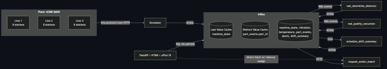

# influxdb3-ref-iiot

Reference architecture: **InfluxDB 3 Enterprise for IIoT / Factory Floor Monitoring**.

Runnable in two minutes with `docker compose`. Simulates an automotive-style assembly
plant (1 plant × 3 lines × 8 stations = 24 machines, ~300 points/sec), runs four
Processing Engine plugins **inside the database** (two WAL detectors, one schedule
rollup, one request endpoint), and ships a control-room dashboard (plant-state
banner, OEE KPIs, andon board served by the request trigger, per-line OEE charts,
recent alerts).



## Quickstart

```bash
git clone https://github.com/influxdata/influxdb3-ref-iiot.git
cd influxdb3-ref-iiot
make up   # prompts for INFLUXDB3_ENTERPRISE_EMAIL on first run
# Click the validation link emailed to you
open http://localhost:8080
make scenario name=unplanned_downtime_cascade
make scenario name=tool_wear_quality_drift
```

Or run the scripted demo end-to-end:

```bash
make demo
```

## What's in this repo

| Path | Purpose |
|------|---------|
| `simulator/` | Python simulator generating realistic IIoT telemetry |
| `plugins/` | Four Processing Engine plugins (Python, run inside InfluxDB) |
| `ui/` | FastAPI + HTMX + uPlot dashboard |
| `influxdb/init.sh` | Bootstraps DB, caches, triggers on first boot |
| `docker-compose.yml` | Full stack: token-bootstrap + influxdb3 + init + simulator + ui + scenarios |
| `Makefile` | `up / down / clean / scenario / cli / test / demo` |
| `tests/` | Three tiers: unit (no Docker) / scenario (testcontainers) / smoke (full stack) |
| `ARCHITECTURE.md` | Schema rationale, OEE math, shift conventions, gotchas, scaling notes |
| `SCENARIOS.md` | Per-scenario walkthroughs |
| `CLI_EXAMPLES.md` | Curated `influxdb3` CLI commands for this vertical |

## Headline Enterprise features on display

### ⬢ Processing Engine — Python plugins running INSIDE the database

| Trigger | File | Fires on | Effect |
|---------|------|----------|--------|
| **WAL** | `plugins/wal_downtime_detector.py` | every write to `machine_state` | Detects state transition to `stopped`/`error` (excludes planned states) and writes an `alerts` row. |
| **WAL** | `plugins/wal_quality_excursion.py` | every write to `part_events` | Maintains per-machine windowed scrap-rate; writes a quality alert when the rate crosses the threshold. |
| **Schedule** | `plugins/schedule_shift_summary.py` | cron `0 0 6,14,22 * * *` | At each shift boundary, writes per-line OEE rollup to `shift_summary`. |
| **Request** | `plugins/request_andon_board.py` | `GET /api/v3/engine/andon_board` | Returns the full plant view as JSON. **The UI calls this directly** (see ⚡ badge in the andon panel). |

Two WAL plugins, intentionally — they show two different patterns: instant transition-detect
vs windowed/derivative. See `ARCHITECTURE.md` § "Processing Engine triggers".

### ⬢ Last Value Cache — single-digit-ms reads on the 24-row machine_state set

Powers the plant-state banner directly and is read by `request_andon_board` to assemble
the JSON response. See `cache-last-compare` in `CLI_EXAMPLES.md`.

### ⬢ Distinct Value Cache — fast distinct-count on high-cardinality tags

`distinct part_id` over today (~700K events at default config) returns in a few ms via the cache (vs. hundreds of ms scanning the table); exact latency depends on the query.
See `cache-distinct` in `CLI_EXAMPLES.md`.

> The LVC and DVC are bound to a *named* table that must already exist when
> `create last_cache` / `create distinct_cache` runs. `init.sh` creates each
> user table explicitly via `POST /api/v3/configure/table` before creating the
> caches — see `ARCHITECTURE.md` § "Table creation: explicit, not implicit".

### ⬢ Custom UI calling Processing Engine directly

> **⚡ The andon-board panel calls the `request_andon_board` plugin via `fetch` directly
> from the browser, not through the FastAPI backend.** The "served by Processing Engine: N ms"
> badge shows the actual round-trip. Other panels query InfluxDB through FastAPI partial
> routes. The Processing Engine pattern lets you ship pre-shaped JSON without a custom
> backend service. See `ARCHITECTURE.md` § "UI data flow" for when to pick which.

## Running the tests

```bash
make test            # tier 1 + tier 2 (skip smoke)
make test-unit       # tier 1 only (no Docker)
make test-scenarios  # tier 2 (testcontainers)
make test-smoke      # tier 3 (real stack; ~3 min)
```

## Scaling to production

Single-node compose is the smallest viable shape. For larger deployments, see
`ARCHITECTURE.md` § "Scaling to production" and the multi-node reference architectures
in the [portfolio](https://github.com/influxdata/influxdb3-reference-architectures).

## License

Apache 2.0 — see [LICENSE](LICENSE).
